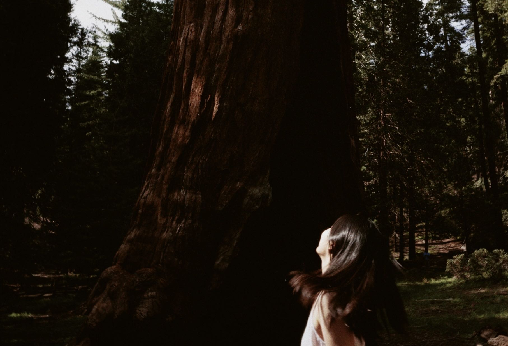
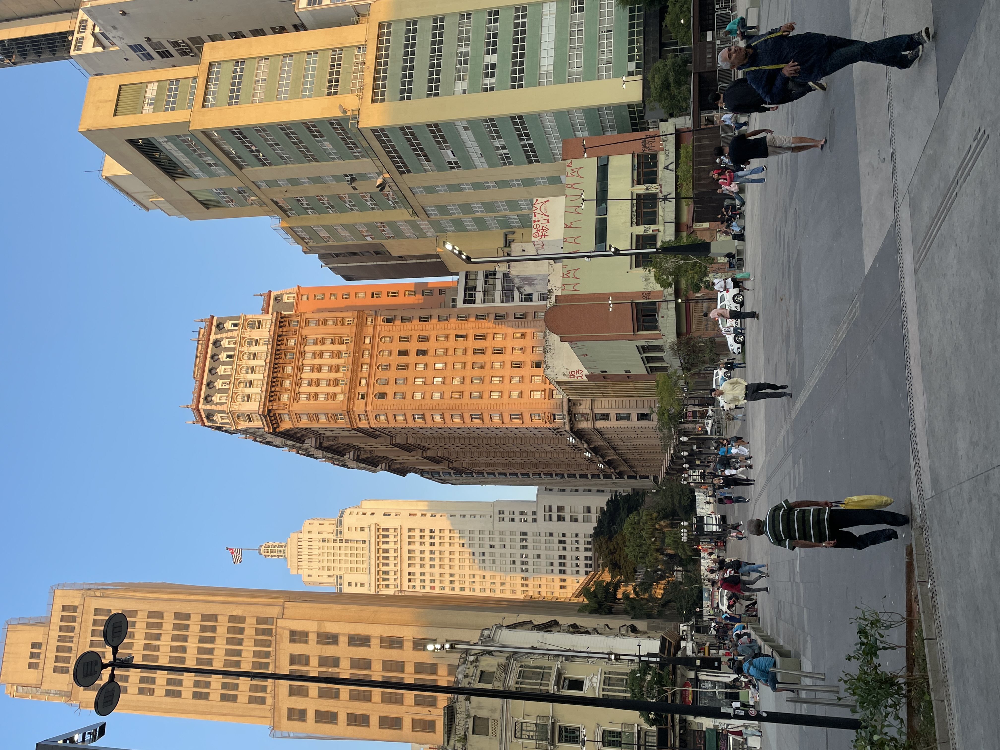
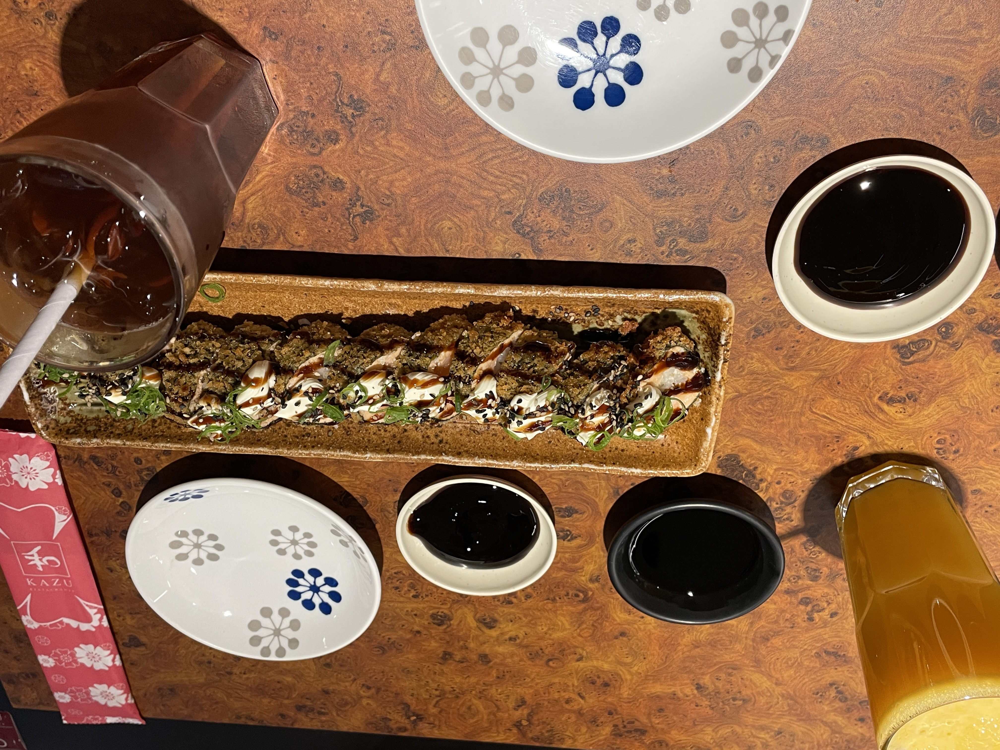
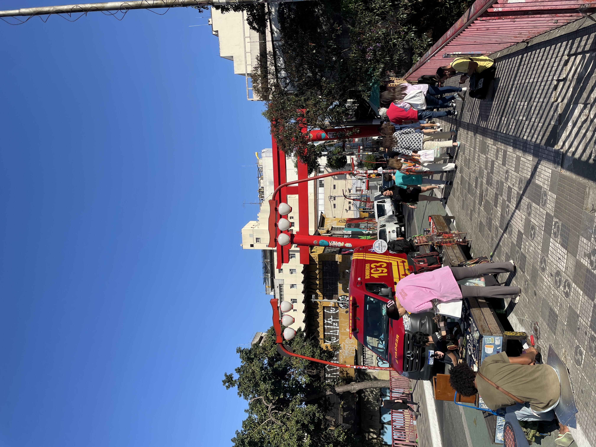
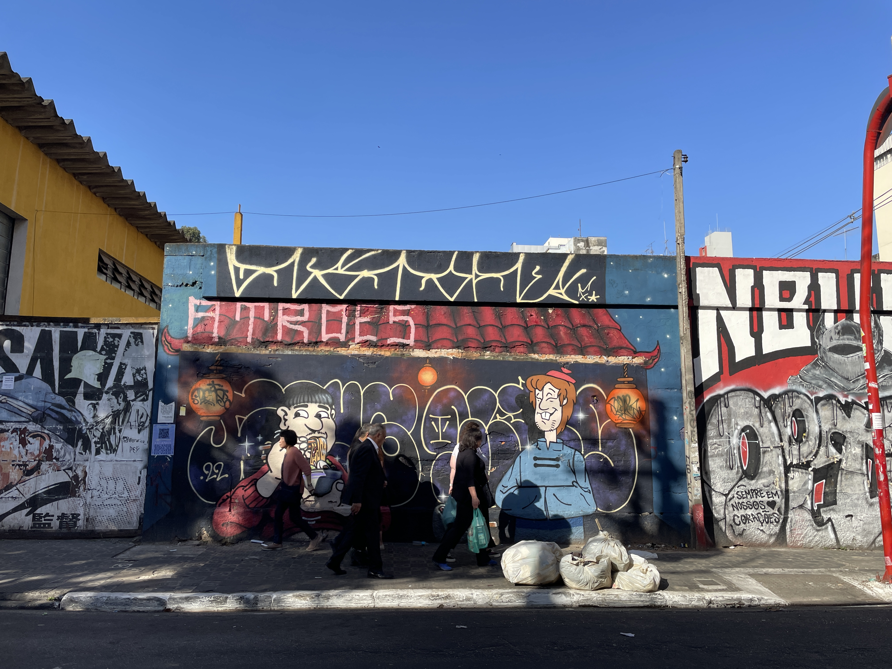

回到纽约的这一个月

<!-- more -->

2023.7.25 下午三点四十，外面正闪电下大雨。刚刚洗完澡，头发可以慢慢风干，夏天真是好时节。给眼镜换了新架托，昨天打扫了房间，一切整齐干净，让人愉悦。远处的雷声，窗外的雨声风声，头顶的闪电，这些「恼人」的存在让我感到平静。

我也越来越喜欢纽约。虽然那个特别想家的秋天和冻到感觉不到鼻涕流出的暖冬曾让我觉得痛苦没有尽头。可是夏天来了，不用叠穿衣服的同时思考怎样不会臃肿，不用出门前把查看天气当成一个必做选项在热度的分子里我可以任由情绪与行为流淌，连肚子也呼吸自由。

七月，有几个昼夜颠倒，一些生理期的电子崩溃，一些对世界的新的好奇和下头。我用整个七月来正视每一丝情绪变化，用整个七月 work on myself 并找到一种吊诡的平衡：

我需要，但也可以不需要。有很好，没有也不赖。

刚刚借了一个充电器，现在在图书馆继续写。Wsq的草坪上躺着和昨天不同又相同的人，喷泉周围坐着一群形散神散的人，偶尔冒出几缕烟雾，太阳离开草坪的时候，也带走了草坪上的人。上周拿到巴西签证，签证照片是随便在ups的店里拍的，那是一个很旧的傻瓜机，甚至没有调光。店里拍照的小姑娘说：This is cute. 我不觉得cute，随便选了一张，不是很重要。纽约对于很多人来说是乱的，但我很少把帆布包的锁拉上，也没有遇到过恶性事件，那天办完护照却小心翼翼拉上了锁链。回到家翻看着上面的四张照片，总觉得自己越来越不像自己，有人说「我觉得最近自己长得越来越奇怪，大概是离开了原本的土壤」那瞬间我觉得自己大概是因为太久没回家而变得奇怪起来。

但那「吊诡的平衡」确实又让我开辟一片新生活的土壤，这是我有过最自由最自我的一个夏天，实在想不到过去哪一个夏天可以和这个夏天比肩。

5月中旬放假后不时一个人出去闲逛，穿梭在各种「只逛不买」的小店之间；想散步的时候就出门散步，七八点去逛超市，有时候扛个西瓜回来对半切开用勺子挖着吃；在East River Park长跑，感谢每一副油亮的古铜色躯体让我坚持跑好远；在西海岸见了可爱朋友；看了些书和电影，《请回答1988》是这个月的电子榨菜，依旧边看边哭，《露水红颜》是看过的电影里最像养成游戏的，《沉沦》是阅读速度最快的小说，黑塞是七月最爱的writer；在好几个深夜发出了一些电子咆哮，不再压抑内心深处的隐藏允许自己有这样或那样的情绪，对我来说更多是一种对"他者"和"本我"位置的重建。

七月，渐渐理解自己在某些不假思索拒绝世界的瞬间。那些和外界所谓的"错过"不是"一子错满盘皆落索"的错，而是我们命定只能相遇在那些个觥筹交错。每个选择的瞬间都更好地认识了自己，让人能更专注直白不遗余力地型塑想要与需要。让目光回到自己身上，对我来说是一种移情的逆向挑战。

下个月要去巴西。

前两天和妈咪打电话，说到在寸土寸金的纽约把房子空一个月好心疼。妈咪却说不要转租，不要给自己带来很多没必要的小的烦恼。我突然想到之前抱怨身为教师的他们把那么多的时间和注意力给其他学生却很少关注我的成长，如果当时多管管我的学习，或许我对于中学时代不会有那么多的遗憾。但就在那个晚上，我突然意识到关于爸妈让我做题，去补习班，家里因为我的学习而变得低气压的回忆，几乎为零。我却清楚地记得一个人在妈妈办公室的周三下午；某个下暴雨的晚上校门外的地面反射的全是车尾红灯，爸爸却能把车停到离校门最近的位置，车门关上后我们三人呆在一起的瞬间和窗外不规则的雨声车鸣；高三的某个周六爸爸给我请假带我去爬山，山上看到很多只小橘猫；高考分数出来的时候，看着自己毫无超水平发挥的分数而失落，爸妈却是开心的。他们从来都不对我的学业有什么要求，给了我没有压力的童年。甚至在供我来纽约念书后，也没有因为高昂的学费生活费就对我抱有比过去更高的期待，或是希望从我身上获得属于家长的回馈。之前去Costco买过一些叶黄素，吃过几次后对眼睛很有用，在电话里给妈妈说「我回国的时候给你们多带一些，还有衣服包包什么的，需要的话就给我说，我也可以寄回去，别怕麻烦。」可爸妈从来都不会给我提这样的需求，哪怕是付代购的价格让别人买，他们也凑个不会提出让女儿去帮忙买什么。「你是去学习，是去感受生活的，不要总想着怎样回报我们，你健康开心就是我们最希望的。」诚然，才发现作为女儿怎样帮他们做事都不是真正的回报，只有把自己过好才是父母最希望看到的。

最近在考虑毕业后的事，爸爸说：「你想做什么我们都支持你，但是如果遇到困难，不要勉强自己」；妈妈说：「事在人为，我女儿是那样有能量的孩子。」我想我一定是世界上最幸福的孩子，因为我有最好的爸爸妈妈。除此之外的痛苦呻吟，实在是自寻烦恼。

今晚回家收拾行李。希望八月，一切顺利。

