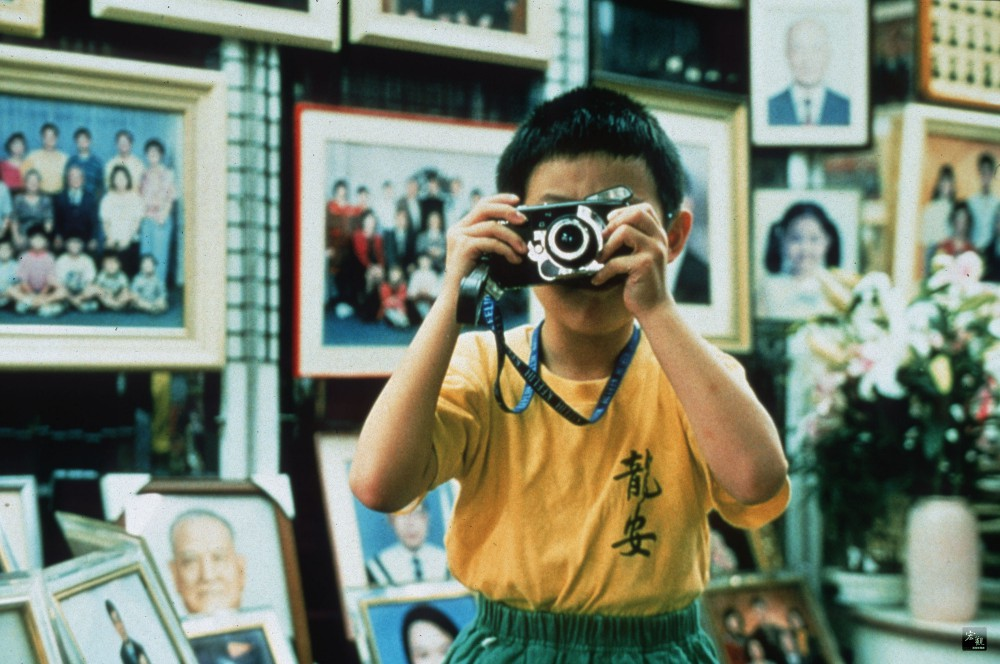
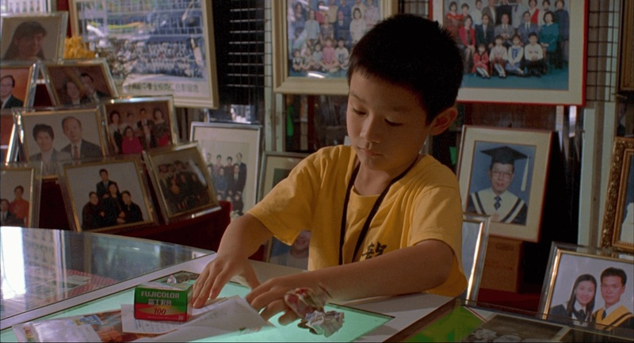
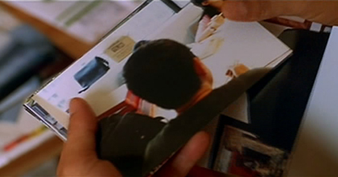

是的，我终于看了《一一》，在又一个醒着的凌晨。

<!-- more -->

杨德昌导演的电影一开始并不在我今年的Film List里，是看到了张震的剧照才从《牯岭街少年杀人事件》才入坑，开始了这场抚摸时间纹理的旅程。《一一》对我来说像是一张黑胶唱片，声音的颗粒随着时间在一点点发生着变化，听众在一旁站着，用耳朵找寻属于自己的那个音符。在看完了第一遍后，我开始不时地在某个时刻翻出这部电影。

**没有一朵云，没有一棵树，是不美丽的。**

一场婚礼开始，一场葬礼结束。

无数人生凝聚在这一百多分钟里，什么是对的，什么又是错的，只有回望的镜头知道。但哪怕回头看当时错得彻彻底底，我们也会认为那时就是对的。我们经历一样的四季，一样的百年，一样的结局，没有人能时刻清楚地知道自己要的幸福究竟是什么，没有谁会成为我们本身，这一生就是我们无数次的剥落。

**因为你看不到，所以我拍给你看**

这句话出现在片尾的情节里，却贯穿整部影片：前女友大闹前男友婚礼现场；闺蜜与&lt;胖子&gt;的三角恋；莉莉回家撞见母亲的丑事；NJ与二十多年前的初恋女友在日本约会；&lt;胖子&gt;在自杀事件中的无声自白。每一幕都让我觉得丑陋，吵闹，不堪入目。然而有趣的是嫌弃之余心里也默认了「这是生活，会真实发生的生活。」面对这样平常琐碎的片段，全片的镜头语言显得温柔冷静又克制。片尾洋洋的话：「因为你看不到，所以我拍给你看」，他相机里洗出来的照片是很多人的后脑勺，大人们拿着照片大笑他拍得乱七八糟。这让人想起和他一样大的年纪，那个我们说「哎呦，我的腰好痛」，却得到大人的「小孩子哪有腰」的年纪。他们以为我们还小什么都不懂，其实因为年纪小，我们对背后的故事反倒看得更清楚。下巴和眼神示意，走到一旁去的谈话。其实很多小孩都知道，只是大人以为他们不知道；也因为是这样的「小孩」，一些他们知道的，就连大人也不知道。

**爱恋是铅笔写下的日记**

「我这样说好了，你不在的时候，我有个机会去过了一段年轻时候的日子，本来以为我再活一次的话也许会有什么不一样，结果还是差不多，没什么不同。只是突然间觉得，再活一次的话，好像真的没那个必要。真的没那个必要。」

这是NJ从日本返回后与妻子坐在床上时说的一段话。在日本出差期间，他与初恋女友重逢，两人当初分手后都组建了家庭，很快有了小孩。中年的他们漫步在无人打扰的街头，在台阶石凳上哭泣大笑，那个漫长的下午与其说是一场久违又奇妙的重逢，更像是一种与过去的和解。如今他在做的，是当初那个自己不愿意做的工作，是那个父母和初恋女友都支持的工作，今天的他和那个年少义无反顾的他又有什么区别。也许是人到中年身不由己之事太多，也许是那误解和执着的等待消磨了冲动的爱意，在对方的祈求和好下，他最终选择了克制地拒绝。那个夜晚的拥抱和初恋的不告而别，像是一声绵远却无痕的叹息。关于我们的那几页，我手里拿着橡皮，却不知道怎样才能把字迹模糊的边缘处理干净。不要和我讲从头来过，我想不到会有什么不同。

回到了「奶奶的葬礼」上。洋洋拿着本子对着婆婆念到：

「婆婆，对不起，不是我不喜欢跟你讲话，只是我觉得我能跟你讲的你一定老早就知道了。不然，你就不会每次都叫我"听话"。就像他们都说你走了，你也没有告诉我你去了哪里，所以，我觉得，那一定是我们都知道的地方。婆婆，我不知道的事情太多了，所以，你知道我以后想做什么吗？我要去告诉别人他们不知道的事情，给别人看他们看不到的东西。我想，这样一定天天都很好玩。说不定，有一天，我会发现你到底去了哪里。到时候，我可不可以跟大家讲，找大家一起过来看你呢？婆婆，我好想你，尤其是我看到那个还没有名字的小表弟，就会想起，你常跟我说：你老了。我也很想跟他说，我也老了。」

这段话像是一篇跋，在时间轴上把这部影片交代完全；它更像是一场沙尘后的烟雨，携有形的故事沉淀在泥土里，留给我们的，是那看得见却摸不到的雾霭。
