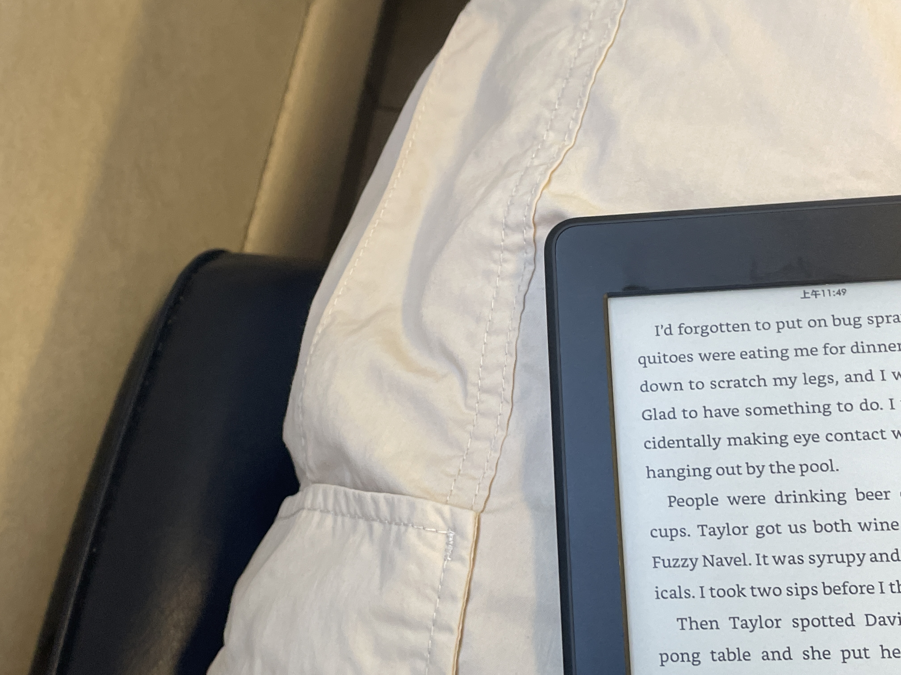

一个长岛周末，一些风的形状

<!-- more -->

上个月K阿姨就叫我去她家玩。K阿姨是爸爸的高中同学，爸妈结婚后也就成了爸妈的好朋友。去年和阿姨一家去上州hiking，不过是秋天的事了。

在Penn station坐Long island rail 大概四十分钟就到了Great Neck。打车去车站比火车票可要贵多了。因为早上起来磨磨蹭蹭地多睡了一小时，又洗了澡。眼看时间不够了，随便拿了一件睡衣，装了电脑和洗漱用品，一顿乱塞。如果刚洗完澡就进纽约地铁，喷再浓的香水都能被地铁里的空气稀释掉。随便进了一节车厢，火车慢悠悠的，几分钟就是一站，掠过房屋座座，湖里有只白色小鸟。

叔叔和Zoe在车站外面接我，我们吃了一顿舒服的午饭，我靠在床上打字，听着隔壁妹妹们的打闹，熟夏的午后太沉静，感觉这一日就要这样被挥霍掉了。下午去石头海滩，妹妹们脱了鞋子跑到海里大笑，我真羡慕这时候的她们没有过去只有未来。脱口而出「年轻真好啊」，阿姨和叔叔笑我「你也小着呢。」

我突然想起小时候。那时候奶奶家在一个超级大院子里，每个楼门洞里都有我的好朋友。

夏天，奶奶会拿出家里的凳子和蒲扇，坐在我们家楼下的空地上和其他奶奶说着家长里短。我都听得懂，但那个时候却可以选择听不懂。这种能力在长大后就消失不见，我再也无法选择"真的听不懂"，而是最多做到"装作没听懂"，还是说为「成长的殇」。梧桐在夏天能盖满整个院子，甚至遮盖住路灯，和西工大的梧桐树无异。我一直无法理解自己有一些毫无根据的喜好，比如，讨厌夏夜，路灯和大风同时出现。

夏夜风起，有时正和朋友们玩「逮人」，不喜欢大喊大叫的我会突然提高嗓门跑到院子的另一侧，试图以此来告诉奶奶我还没玩够，不要急着叫我回家；有时候正趴在奶奶膝盖上听叶子沙沙的声音，听小虫子「啾啾」叫，看天上一闪一闪。大人们眼里这时候的我是安静的，殊不知我内心正狂躁地大喊着「不要现在回去」风一停，大人继续聊着就好像度过了一劫。倒不是家里有什么只是我很喜欢看见大人坐在一起笑着说话，看一晃一晃的蒲扇，在路灯下玩到满头大汗。

等到稍微大一点，对「夜里起风」的害怕转换为对大人突然沉默的担忧。跟着父母去各种「包间聚会」，大人的沉默也一种闹钟，一旦有了沉默，就总会有那么一个人突然说

「那行，咱撤吧！」

其他人好像提前拿到了脚本一样，非常迅速流畅地接了句

「走！不早了，你们明天还要上班」

或者突然看向角落里发呆的我说

「娃都困了」

拜托，你们大人总是拿我当借口。

从小就喜欢生闷气，倒不是因为真的有那么多气，而是这是我唯一的表达方式：朋友被家长带回家了，我难过，但是我怕哭出来会被觉得不坚强，于是我只能生气；被门夹了手，疼得哭出来了，但是怕妈妈说我不小心，就又直接进入到生气阶段；爸爸和叔叔要出差几天，我难过，但是我怕爸爸说我撒娇，所以只能生气。后来爸爸把我哄好了，问我想要什么都可以买给我。我说

「爸爸，我给你一个玻璃罐，你给我装一小朵云回来」，爸爸笑了，

「这个不行呀」

我就又开始生气地说「明明一打开窗户就能伸手够到！」

爸爸无奈地朝妈妈摇摇头。其实我是知道的，我们都抓不到云朵，可我只是不想让你走。

但只要看到我生气或者其他大人数落我，爷爷总是第一个弯腰站在我前面，一面和我说

「女孩子不能生气！爷爷给你说，不要生气」

又侧过身对大人说：

「你说她干啥！多大点事」

我那时候以为自己是有道理的，其实只是站在爷爷的软肋上，「胡作非为。」其实我不是真的生气，只是害怕让别人知道我想说：航航，你能不能不回家；爸爸，你能不能不出差；妈妈，我的手指真的很痛。我知道他们做不到这些，明明不会改变的事，说了有什么用呢，但是生生气总可以吧。

我离那样的日子已经很远了。现在的我正站在一个尴尬的年龄，有一点不能释怀的过去，有很多够不着的未来，忧愁在情绪里疯狂颤动，期许也时常蹦跳。感觉自己是这样年轻却又这样衰老。回程的路上妹妹们在后座上睡着，我强忍困意和叔叔阿姨聊天，不知不觉成为了这样的角色。虽然很多东西都是假的，但我需要雨天，一个潮湿的雨天连着一个潮湿的雨天，需要雨点一个一个「踏实」地打在我身上，让深沉的流动的情欲得到掷地有声的回应。没有落到海平面的日落也还算美。

我们坐在海边小餐馆，看着从康州到长岛的轮渡靠近岸边，

她们拽拽我的衣角问：

「姐姐，你有没有男朋友」

「你们很八卦诶」

「可是真的很想知道」

她俩半蹲着眨巴眼睛看着我。

回家后我倒头睡了两三个小时，醒来天已经全黑，和国内打电话。半夜一点又要睡去，却怎么都睡不着，最终通宵。今年我常常失眠，买来了褪黑素隔一天吃一片，已经没有了药性。周日下午去summer stage听wawa的露天演唱会：

「Don't cry, don't cry」「这是唱给所有的不被理解」

「你啊，你啊」「当初边写边哭」一万次心碎换一个完整的我

「爱是世界很远你很近」可你站在我旁边我却感觉是在两个宇宙

她穿着紫花连衣裙，一阵风吹过来，吹出腿的形状，A5AA的集体大合唱让人想永远留在这样的夏天。还是没睡够，我站在摇晃的人群里，像是游完是几个来回上岸，上气不接下气。真希望能种下风的种子。

And already, I was counting the days until summer was over.

